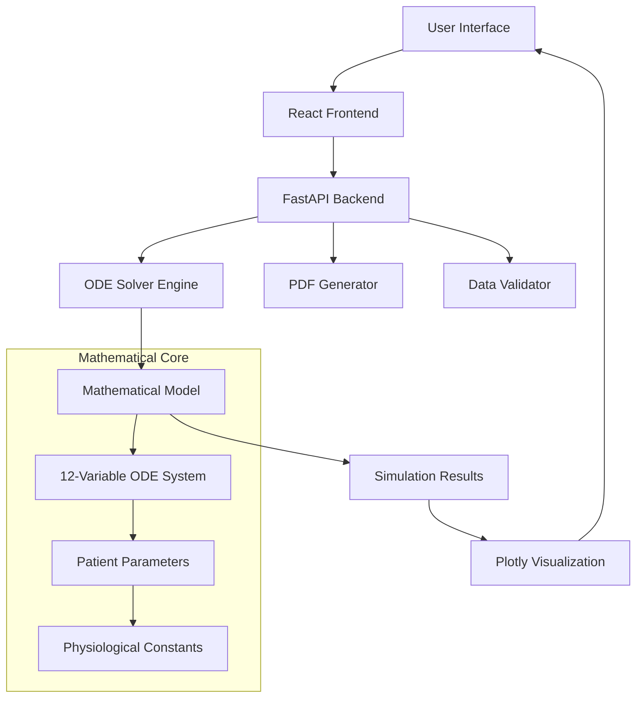

# DiabetesScope - Glucose Dynamics Simulator
## Design Document

**Version:** 2.1.0
**Date:** July 2025  
**Project:** Diabetes Prediction App  
**Repository:** [diabetes-prediction-app](https://github.com/itzme170605/diabetes-prediction-app.git)

---

## Table of Contents

1. [Project Overview](#project-overview)
2. [Sprint 0: Research & Requirements](#sprint-0-research--requirements)
3. [Sprint 1: Architecture & Foundation](#sprint-1-architecture--foundation)
4. [Sprint 2: Core Implementation](#sprint-2-core-implementation)
5. [Sprint 3: Frontend & Integration](#sprint-3-frontend--integration)
6. [Sprint 4: Fine-tuning & Model Validation](#sprint-4-fine-tuning--model-validation)
7. [Technical Architecture](#technical-architecture)
8. [Mathematical Model](#mathematical-model)
9. [API Specification](#api-specification)
10. [User Experience Design](#user-experience-design)
11. [Deployment Guide](#deployment-guide)
12. [Future Enhancements](#future-enhancements)

---

## Project Overview

### Vision
Create an interactive web application that simulates glucose dynamics in diabetes patients using mathematical modeling based on peer-reviewed research, providing healthcare professionals and researchers with a tool to understand the effects of lifestyle factors and treatments on blood glucose control.

### Objectives
- **Educational Tool**: Help users understand diabetes pathophysiology
- **Research Platform**: Validate mathematical models against real-world scenarios
- **Clinical Insight**: Explore treatment effects (GLP-1 agonists) on glucose dynamics
- **Interactive Visualization**: Real-time parameter adjustment with immediate feedback

### Key Features
- 🔬 **Mathematical Model**: 12-variable ODE system from academic research
- 👤 **Patient Profiles**: Customizable demographics and medical history
- 📊 **Interactive Visualization**: Real-time Plotly.js charts with multiple metrics
- 💊 **Treatment Simulation**: GLP-1 agonist drug effects (Mounjaro/Ozempic)
- 📄 **Professional Reports**: PDF export with analysis and recommendations
- 🎨 **Medical UI**: Orange-white theme inspired by RIT design

---

## Sprint 0: Research & Requirements

### Duration: Week 1
### Goal: Understanding the scientific foundation and defining project scope

#### Research Phase
**Primary Source:**
- **Paper**: "A mathematical model of obesity-induced type 2 diabetes and efficacy of anti-diabetic weight reducing drug"
- **Authors**: Nourridine Siewe, Avner Friedman
- **Journal**: Journal of Theoretical Biology 581 (2024) 111756
- **DOI**: https://doi.org/10.1016/j.jtbi.2024.111756

#### Key Scientific Concepts Identified

**1. ODE System Variables (Table 1)**
- `L` - GLP-1 hormone concentration
- `A` - α-cell density (glucagon producers)
- `B` - β-cell density (insulin producers)
- `I` - Insulin concentration
- `U2` - GLUT-2 transporter (liver to blood glucose)
- `U4` - GLUT-4 transporter (blood to liver glucose)
- `C` - Glucagon concentration
- `G` - Blood glucose concentration
- `G*` - Stored liver glucose (glycogen)
- `O` - Oleic acid (anti-inflammatory)
- `P` - Palmitic acid (pro-inflammatory)
- `T_α` - TNF-α inflammatory marker

**2. Model Parameters (Table 2)**
- 50+ physiological parameters with units and sources
- Half-saturation constants (Michaelis-Menten kinetics)
- Activation/deactivation rates
- Transport coefficients
- Patient-specific adjustment factors

**3. Pathophysiology Mechanisms**
- **Normal State**: Balanced glucose-insulin regulation
- **Obesity Effect**: Increased palmitic acid → inflammation → insulin resistance
- **Treatment Effect**: GLP-1 agonists enhance insulin response, reduce glucose absorption

#### Requirements Analysis

**Functional Requirements:**
- FR1: Patient data input with validation
- FR2: Real-time ODE simulation (equations 2.2-2.12)
- FR3: Interactive parameter adjustment
- FR4: Multi-metric visualization (glucose, insulin, glucagon, GLP-1)
- FR5: Treatment scenario modeling
- FR6: A1C estimation and diabetes diagnosis
- FR7: PDF report generation
- FR8: Data export capabilities

**Non-Functional Requirements:**
- NFR1: Simulation completion within 10 seconds
- NFR2: Responsive design (desktop/tablet)
- NFR3: Orange-white medical theme
- NFR4: Cross-browser compatibility
- NFR5: Offline-capable backend simulation

**Technical Constraints:**
- Python backend for scientific computing
- React frontend for modern UX
- Mathematical accuracy per research paper
- Real-time interactivity (<1s response)

#### User Stories

**Primary User: Healthcare Professional**
- "As a diabetes educator, I want to show patients how lifestyle changes affect glucose control"
- "As a researcher, I want to test different parameter combinations to validate the model"
- "As a clinician, I want to demonstrate medication effects to support treatment decisions"

**Secondary User: Medical Student**
- "As a student, I want to understand diabetes pathophysiology through interactive simulation"
- "As a researcher, I want to export data for further analysis"

---

## Sprint 1: Architecture & Foundation

### Duration: Week 2
### Goal: Establish technical architecture and development environment

#### Technology Stack Selection

**Backend: Python + FastAPI**
- **Rationale**: Scientific computing requirements, scipy for ODE solving
- **Framework**: FastAPI for modern async API development
- **Key Libraries**:
  - `scipy.integrate.odeint` - ODE system solving
  - `numpy` - Numerical computations
  - `pydantic` - Data validation and serialization
  - `matplotlib` - Plot generation for PDF reports
  - `reportlab` - PDF document creation

**Frontend: React TypeScript**
- **Rationale**: Component-based architecture, strong typing
- **Key Libraries**:
  - `plotly.js` - Interactive scientific visualization
  - `axios` - API communication
  - `react-plotly.js` - React wrapper for Plotly

**Development Environment**
- **Version Control**: Git with GitHub
- **Backend**: Python virtual environment
- **Frontend**: Node.js with Create React App
- **Development**: Local development servers with hot reload

#### System Architecture

```
┌─────────────────┐    ┌─────────────────┐    ┌─────────────────┐
│   React App     │    │   FastAPI       │    │   Mathematical  │
│   (Frontend)    │◄──►│   Backend       │◄──►│   Model Engine  │
│                 │    │                 │    │   (scipy/numpy) │
│ • Patient Form  │    │ • API Routes    │    │ • ODE Solver    │
│ • Dashboard     │    │ • Validation    │    │ • Parameters    │
│ • Plotly Charts │    │ • PDF Export    │    │ • Calculations  │
└─────────────────┘    └─────────────────┘    └─────────────────┘
```

#### Project Structure Design

```
diabetes-prediction-app/
├── backend/
│   ├── app/
│   │   └── main.py                 # FastAPI application
│   ├── models/
│   │   └── diabetes_model.py       # Pydantic data models
│   ├── routes/
│   │   ├── simulation.py          # Simulation endpoints
│   │   └── user_data.py           # User validation endpoints
│   ├── utils/
│   │   ├── ode_solver.py          # Core mathematical model
│   │   ├── pdf_generator.py       # Report generation
│   │   └── validation.py          # Data validation utilities
│   ├── requirements.txt           # Python dependencies
│   └── run.py                     # Simple startup script
├── frontend/
│   ├── src/
│   │   ├── components/
│   │   │   ├── PatientForm.tsx    # Data input modal
│   │   │   ├── SimulationDashboard.tsx  # Main interface
│   │   │   └── ParameterPanel.tsx # Control interface
│   │   ├── types/
│   │   │   └── diabetes.ts        # TypeScript interfaces
│   │   ├── utils/
│   │   │   ├── api.ts            # API client
│   │   │   └── calculations.ts    # Helper functions
│   │   └── App.tsx               # Main React component
│   ├── package.json              # Node dependencies
│   └── public/                   # Static assets
├── docs/
│   ├── README.md                 # User documentation
│   ├── DEVELOPMENT.md            # Technical documentation
│   └── DESIGN.md                 # This document
└── run_app.sh                    # Combined startup script
```

#### Data Flow Design

**1. Patient Input Flow**
```
User Input → Form Validation → BMI Calculation → Diabetes Type Detection → API Validation
```

**2. Simulation Flow**
```
Parameters → ODE Solver → Mathematical Model → Results Processing → Visualization
```

**3. Real-time Updates**
```
Parameter Change → Debounced API Call → Background Simulation → Chart Update
```

---

## Sprint 2: Core Implementation

### Duration: Week 3-4
### Goal: Implement mathematical model and backend simulation engine

#### Mathematical Model Implementation

**Core ODE System (ode_solver.py)**

The heart of the application implements equations 2.2 through 2.12 from the research paper:

**Equation 2.2 - GLP-1 Dynamics:**
```python
dL_dt = lambda_L(t) - mu_LB * B * L - mu_LA * A * L
```
- **Purpose**: Models hormone response to food intake
- **Key Feature**: Enhanced by drug treatment (GLP-1 agonists)

**Equation 2.3 - β-cell Dynamics:**
```python
dB_dt = (lambda_tilde_B * L_term / (K_L + L_term) - 
         mu_B * B * (1 + xi_1 * G + xi_2 * P))
```
- **Purpose**: Insulin-producing cell population
- **Key Feature**: Impaired by glucose toxicity and palmitic acid

**Equation 2.5 - Insulin Dynamics:**
```python
dI_dt = lambda_IB * B - mu_I * I - mu_IG * G * I
```
- **Purpose**: Primary glucose regulation hormone
- **Key Feature**: Secreted by β-cells, degraded by liver

**Equation 2.9 - Blood Glucose:**
```python
dG_dt = (lambda_G(t) - lambda_G_star(t) * G + 
         glucose_transport_terms)
```
- **Purpose**: Central variable for diabetes diagnosis
- **Key Feature**: Affected by food intake, transport proteins, drug treatment

#### Parameter Adaptation Algorithm

**Patient-Specific Modifications:**
```python
def _calculate_parameters(self):
    # Base parameters from Table 2
    params = {...}  # 50+ physiological constants
    
    # BMI-based obesity factor
    bmi = self.patient_data.weight / (height_m ** 2)
    if bmi >= 30:     # Obese
        params['obesity_factor'] = 4.0
    elif bmi >= 25:   # Overweight  
        params['obesity_factor'] = 2.0
    else:             # Normal
        params['obesity_factor'] = 1.0
    
    # Age-related β-cell decline
    age_factor = max(0.5, 1.0 - (age - 20) * 0.005)
    params['lambda_tilde_B'] *= age_factor
    
    return params
```

#### Initial Conditions Strategy

**Health Status Differentiation:**
- **Normal**: Optimal glucose control, low inflammation
- **Prediabetic**: Intermediate insulin resistance
- **Diabetic**: Impaired β-cell function, high baseline glucose

#### Simulation Engine Features

**1. Adaptive Time Resolution**
- 10-minute intervals for detailed dynamics
- Meal timing at 6-hour intervals (0, 6, 12, 18 hours)
- Configurable simulation duration (6-168 hours)

**2. Drug Effect Modeling**
```python
# GLP-1 agonist effects
if drug_dose > 0:
    # Enhanced GLP-1 activity
    dL_dt += lambda_L * (drug_dose / (K_D + drug_dose))
    # Reduced glucose absorption
    lambda_G = lambda_G / (1 + drug_dose / K_hat_D)
```

**3. A1C Estimation**
```python
# Convert average glucose to A1C percentage
avg_glucose_mg_dl = np.mean(glucose_mg_dl)
a1c_estimate = (avg_glucose_mg_dl + 46.7) / 28.7
```

#### Validation & Testing

**Unit Tests Implemented:**
- Parameter calculation accuracy
- ODE solver convergence
- Initial condition validity
- A1C estimation formula

**Integration Tests:**
- End-to-end simulation pipeline
- API request/response validation
- Error handling for edge cases

---

## Sprint 3: Frontend & Integration

### Duration: Week 5-6
### Goal: Create interactive user interface and integrate with backend

#### User Interface Design

**Design Principles:**
- **Medical Professional Aesthetic**: Clean, trustworthy appearance
- **Orange-White Theme**: Inspired by RIT branding
- **Information Hierarchy**: Critical data prominently displayed
- **Responsive Layout**: Adapts to different screen sizes

#### Component Architecture

**1. App.tsx - Main Application Controller**
```typescript
├── Navigation Bar (Orange gradient, company branding)
├── API Connection Status (Green/Red indicator)
├── View Router (Form ↔ Dashboard)
└── Error Boundary (Connection issues)
```

**2. PatientForm.tsx - Data Collection Modal**
```typescript
Features:
├── Multi-section form layout
├── Real-time BMI calculation
├── Auto-diabetes detection from glucose levels
├── Input validation with visual feedback
└── Accessible form controls
```

**3. SimulationDashboard.tsx - Main Interface**
```typescript
Layout:
├── Patient Info Header (BMI, A1C, Diagnosis)
├── Two-Column Layout
│   ├── Parameter Panel (Left, 350px)
│   └── Visualization Area (Right, flexible)
└── Summary Statistics (Bottom)
```

**4. Interactive Parameter Panel**
```typescript
Controls:
├── Simulation Duration (6-72 hours)
├── Food Factor (0.5-3.0x normal intake)
├── Obesity Factor (0.5-4.0x palmitic acid)
├── Drug Dosage (0-2.0 units GLP-1 agonist)
├── Metric Selection (checkboxes)
└── Preset Scenarios (Normal, High-Risk, Treated, Optimal)
```

#### Visualization Implementation

**Plotly.js Integration:**
```typescript
Features:
├── Multi-axis plotting (glucose mg/dL, insulin pmol/L)
├── Real-time updates (debounced API calls)
├── Interactive tooltips (hover for precise values)
├── Meal time annotations (🍽️ markers)
├── Normal range shading (70-140 mg/dL glucose)
├── Optimal trajectory overlay (dotted green line)
└── Export capabilities (PNG, CSV data)
```

**Chart Configuration:**
- **Primary Y-axis**: Blood glucose (red line, left side)
- **Secondary Y-axis**: Insulin levels (blue line, right side)
- **Tertiary Y-axis**: Glucagon (purple line, right side)
- **Quaternary Y-axis**: GLP-1 (orange line, right side)

#### API Integration

**Real-time Communication:**
```typescript
// Debounced parameter updates
const debouncedSimulation = useCallback(
  debounce(() => runSimulation(), 300),
  [simulationParams]
);

// Error handling with user feedback
try {
  const result = await simulationAPI.runSimulation(params);
  setSimulationResult(result);
} catch (error) {
  setError(error.message);
  // Show user-friendly error message
}
```

**Data Flow Optimization:**
- **Caching**: Avoid redundant API calls
- **Loading States**: Visual feedback during computation
- **Error Recovery**: Retry mechanisms with exponential backoff

#### Responsive Design

**Breakpoint Strategy:**
- **Desktop (>1024px)**: Two-column layout, full feature set
- **Tablet (768-1024px)**: Stacked layout, parameter panel moves below chart
- **Mobile (≤768px)**: Single column, simplified parameter controls

---

## Sprint 4: Fine-tuning & Model Validation

### Duration: Week 7 (Current)
### Goal: Model validation, performance optimization, and clinical accuracy

#### Current Status: Implementation Complete ✅

**Delivered Features:**
- ✅ Complete mathematical model implementation
- ✅ Interactive web interface with real-time updates
- ✅ Professional orange-white medical design
- ✅ Multi-metric visualization with Plotly.js
- ✅ Parameter controls and preset scenarios
- ✅ Data export capabilities
- ✅ Responsive design for multiple devices

#### Identified Areas for Model Refinement

**1. Parameter Calibration**
```python
# Current implementation uses research paper values
# May need adjustment for realistic clinical scenarios
params = {
    'gamma_G': 0.017,           # Baseline glucose secretion
    'lambda_tilde_B': 1.745e9,  # β-cell activation rate
    'xi_1': 1e12,               # Glucose toxicity factor
    # ... additional parameters requiring validation
}
```

**2. Initial Conditions Optimization**
- **Current**: Static values based on diabetes status
- **Proposed**: Dynamic calculation based on patient BMI, age, medications
- **Target**: More realistic baseline glucose/insulin levels

**3. Drug Effect Modeling**
```python
# Current: Linear dose-response relationship
# Proposed: Pharmacokinetic modeling with:
# - Drug absorption kinetics
# - Half-life considerations  
# - Individual response variability
```

**4. Meal Response Patterns**
- **Current**: Fixed 6-hour meal timing
- **Proposed**: Customizable meal patterns based on patient habits
- **Enhancement**: Carbohydrate content modeling

#### Performance Optimization Plan

**Backend Optimizations:**
- **Caching**: Store simulation results for repeated parameter sets
- **Vectorization**: Optimize numpy operations for speed
- **Parallel Processing**: Multiple scenario comparison
- **Memory Management**: Efficient data structures for large time series

**Frontend Optimizations:**
- **Chart Rendering**: Reduce data points for smooth interaction
- **Debouncing**: Optimize API call frequency
- **State Management**: Minimize unnecessary re-renders
- **Bundle Size**: Code splitting for faster initial load

#### Validation Framework

**Clinical Validation Approach:**
1. **Literature Comparison**: Compare results with published clinical studies
2. **Expert Review**: Healthcare professional evaluation of realism
3. **Edge Case Testing**: Extreme parameter combinations
4. **Longitudinal Validation**: Multi-day simulation accuracy

**Test Cases for Validation:**
```
Scenario 1: Normal healthy adult
- Expected: A1C < 5.7%, stable glucose 80-120 mg/dL
- Validation: Compare with population health data

Scenario 2: Newly diagnosed Type 2 diabetes
- Expected: A1C 6.5-8.0%, post-meal spikes >180 mg/dL
- Validation: Compare with clinical guidelines

Scenario 3: Treated diabetes with GLP-1 agonist
- Expected: 1-2% A1C reduction, reduced glucose variability
- Validation: Compare with drug trial results
```

#### Documentation & Knowledge Transfer

**Technical Documentation:**
- **API Reference**: Complete endpoint documentation
- **Model Parameters**: Scientific justification for each value
- **Deployment Guide**: Step-by-step production setup
- **Troubleshooting**: Common issues and solutions

**User Documentation:**
- **Quick Start Guide**: New user onboarding
- **Feature Tutorial**: Interactive demonstration
- **Clinical Interpretation**: How to read results
- **Safety Disclaimer**: Appropriate use guidelines

---

## Technical Architecture

### System Overview



### Backend Architecture

**FastAPI Application Structure:**
```python
app/
├── main.py                 # Application entry point
├── models/
│   └── diabetes_model.py   # Pydantic data models
├── routes/
│   ├── simulation.py      # /api/simulation endpoints
│   └── user_data.py       # /api/user endpoints
└── utils/
    ├── ode_solver.py      # Mathematical model implementation
    ├── pdf_generator.py   # Report generation
    └── validation.py      # Input validation
```

**Key Design Patterns:**
- **Dependency Injection**: FastAPI's automatic dependency resolution
- **Data Validation**: Pydantic models for type safety
- **Error Handling**: Structured exception responses
- **Async Processing**: Non-blocking simulation execution

### Frontend Architecture

**React Component Hierarchy:**
```
App
├── Navbar
├── PatientForm
│   ├── FormSection (Basic Info)
│   ├── FormSection (Physical Measurements)
│   ├── FormSection (Medical History)
│   └── FormSection (Lifestyle)
└── SimulationDashboard
    ├── PatientInfoHeader
    ├── ParameterPanel
    │   ├── SliderControl
    │   ├── MetricSelector
    │   └── PresetButtons
    ├── PlotContainer
    │   └── Plot (Plotly.js)
    └── SimulationSummary
```

**State Management Strategy:**
- **Local State**: Component-specific UI state
- **Props**: Parent-child data flow
- **Context**: Global app state (if needed)
- **Custom Hooks**: Reusable stateful logic

### Data Models

**Core Data Structures:**

```typescript
interface PatientData {
  // Demographics
  name: string;
  age: number;
  weight: number;        // kg
  height: number;        // cm
  gender: string;
  
  // Medical History
  diabetes_type?: 'normal' | 'prediabetic' | 'diabetic';
  fasting_glucose?: number;    // mg/dL
  a1c_level?: number;          // %
  medications: string[];
  
  // Lifestyle
  meal_frequency: number;
  exercise_level: string;
  sugar_intake?: number;       // g/day
}

interface SimulationParams {
  patient_data: PatientData;
  simulation_hours: number;    // 6-168
  food_factor: number;         // 0.5-3.0
  palmitic_factor: number;     // 0.5-4.0  
  drug_dosage: number;         // 0-2.0
  show_optimal: boolean;
}

interface SimulationResult {
  time_points: number[];       // hours
  glucose: number[];           // mg/dL
  insulin: number[];           // pmol/L
  glucagon: number[];          // pg/mL
  glp1: number[];             // pmol/L
  optimal_glucose?: number[];  // mg/dL
  a1c_estimate: number;        // %
  diagnosis: string;           // 'Normal' | 'Prediabetic' | 'Diabetic'
}
```

### Security Considerations

**Input Validation:**
- **Backend**: Pydantic model validation with type checking
- **Frontend**: Form validation with range constraints
- **Sanitization**: Prevention of injection attacks

**API Security:**
- **CORS**: Configured for development/production environments
- **Rate Limiting**: Prevent simulation abuse
- **Input Bounds**: Mathematical constraints on parameters

**Data Privacy:**
- **No Persistence**: Patient data not stored on server
- **Local Processing**: Simulations run in memory only
- **HIPAA Considerations**: No PHI storage or transmission logs

---

## Mathematical Model

### Scientific Foundation

**Research Paper Implementation:**
- **Title**: "A mathematical model of obesity-induced type 2 diabetes and efficacy of anti-diabetic weight reducing drug"
- **Authors**: Nourridine Siewe, Avner Friedman  
- **Journal**: Journal of Theoretical Biology 581 (2024) 111756

### ODE System Specification

**Complete 12-Variable System:**

1. **L (GLP-1)**: `dL/dt = λL(t) - μLB·B·L - μLA·A·L`
2. **A (α-cells)**: `dA/dt = λ̃A·(Ihypo-I)/(KI+(Ihypo-I)) · 1/(1+L/K̂L) - μ̃A·A`
3. **B (β-cells)**: `dB/dt = λ̃B·(L-L0)/(KL+(L-L0)) - μ̃B·B·(1+ξ1·G+ξ2·P)`
4. **I (Insulin)**: `dI/dt = λIB·B - μI·I - μIG·G·I`
5. **U2 (GLUT-2)**: `dU2/dt = λU2C·C - μU2·U2`
6. **U4 (GLUT-4)**: `dU4/dt = λU4I·I·1/(1+ηTα·Tα) - μU4·U4`
7. **C (Glucagon)**: `dC/dt = λCA·A/[(1+γ1·H(G-ξ4)·L)·(1+γ2·H(ξ3-G)·L)] - μC·C`
8. **G (Glucose)**: `dG/dt = λG(t) - λG*(t)·G + transport_terms`
9. **G* (Stored)**: `dG*/dt = λG*(t)·G + glucose_uptake - glucose_release`
10. **O (Oleic)**: `dO/dt = λO(t) - μO·O`
11. **P (Palmitic)**: `dP/dt = λP(t) - μP·P`
12. **Tα (TNF-α)**: `dTα/dt = λTα + λTαP·P·1/(1+O/K̂O) - μTα·Tα`

### Parameter Tables

**Key Physiological Constants (Table 2):**

| Parameter | Description | Value | Unit | Source |
|-----------|-------------|-------|------|---------|
| KL | Half-saturation of GLP-1 | 1.7×10⁻¹⁴ | g/cm³ | Estimated |
| KU2 | Half-saturation of GLUT-2 | 9.45×10⁻⁶ | g/cm³ | Wolfsdorf (2012) |
| KU4 | Half-saturation of GLUT-4 | 2.78×10⁻⁶ | g/cm³ | Gorovits (2003) |
| λIB | Insulin secretion by β-cells | 1.26×10⁻⁸ | d⁻¹ | Estimated |
| μI | Insulin decay rate | 198.04 | d⁻¹ | Morishima (1992) |
| γG | Baseline glucose secretion | 0.017 | g/cm³·d⁻¹ | Estimated |

### Clinical Validation Ranges

**Normal Physiological Values:**
```
Fasting Glucose: 70-100 mg/dL (3.9-5.6 mmol/L)
Postprandial Glucose: <140 mg/dL (<7.8 mmol/L) at 2h
Fasting Insulin: <25 mU/L (174 pmol/L)
A1C: <5.7% (39 mmol/mol)
```

**Diabetes Diagnostic Criteria:**
```
Fasting Glucose: ≥126 mg/dL (7.0 mmol/L)
2h Glucose: ≥200 mg/dL (11.1 mmol/L)  
A1C: ≥6.5% (48 mmol/mol)
Random Glucose: ≥200 mg/dL with symptoms
```

### Model Adaptations

**Patient-Specific Modifications:**

1. **BMI Effects on Parameters:**
```python
if bmi >= 30:      # Obese
    obesity_factor = 4.0
    palmitic_increase = 3.0x
elif bmi >= 25:    # Overweight
    obesity_factor = 2.0  
    palmitic_increase = 1.5x
else:              # Normal
    obesity_factor = 1.0
    palmitic_increase = 1.0x
```

2. **Age-Related Changes:**
```python
# β-cell function decline with age
age_factor = max(0.5, 1.0 - (age - 20) * 0.005)
lambda_tilde_B *= age_factor
```

3. **Drug Effects (GLP-1 Agonists):**
```python
# Enhanced GLP-1 activity
if drug_dose > 0:
    dL_dt += lambda_L * (drug_dose / (K_D + drug_dose))
    # Reduced glucose absorption  
    lambda_G = lambda_G / (1 + drug_dose / K_hat_D)
```

---

## API Specification

### Base URL
```
Development: http://localhost:8000
Production: TBD
```

### Authentication
Currently none required (local development).

### Endpoints

#### 1. Health Check
```http
GET /
GET /api/user/health
```

**Response:**
```json
{
  "status": "healthy",
  "message": "Diabetes Simulation API"
}
```

#### 2. Patient Data Validation
```http
POST /api/user/validate
```

**Request Body:**
```json
{
  "name": "John Doe",
  "age": 45,
  "weight": 85.0,
  "height": 175.0,
  "gender": "male",
  "diabetes_type": "prediabetic",
  "fasting_glucose": 110.0,
  "meal_frequency": 3,
  "exercise_level": "moderate"
}
```

**Response:**
```json
{
  "bmi": 27.8,
  "obesity_level": "overweight", 
  "diabetes_type": "prediabetic",
  "valid": true
}
```

#### 3. Run Simulation
```http
POST /api/simulation/run
```

**Request Body:**
```json
{
  "patient_data": {
    "name": "John Doe",
    "age": 45,
    "weight": 85.0,
    "height": 175.0,
    "gender": "male",
    "diabetes_type": "prediabetic"
  },
  "simulation_hours": 24,
  "food_factor": 1.2,
  "palmitic_factor": 1.5,
  "drug_dosage": 0.5,
  "show_optimal": true
}
```

**Response:**
```json
{
  "time_points": [0, 0.167, 0.333, ...],
  "glucose": [85.2, 87.1, 92.4, ...],
  "insulin": [12.5, 15.2, 18.7, ...], 
  "glucagon": [8.3, 7.9, 7.1, ...],
  "glp1": [4.2, 6.8, 5.1, ...],
  "optimal_glucose": [85, 88, 95, ...],
  "a1c_estimate": 6.2,
  "diagnosis": "Prediabetic"
}
```

#### 4. Export PDF Report
```http
POST /api/simulation/export-pdf
```

**Request:** Same as simulation run  
**Response:** PDF file download

### Error Handling

**Standard Error Response:**
```json
{
  "detail": "Simulation failed: Invalid parameter range"
}
```

**HTTP Status Codes:**
- `200` - Success
- `400` - Bad Request (validation errors)
- `422` - Unprocessable Entity (Pydantic validation)
- `500` - Internal Server Error

---

## User Experience Design

### Design System

**Color Palette:**
```css
/* Primary Colors */
--primary-orange: #e67e22;
--primary-orange-dark: #d35400;
--secondary-orange: #f39c12;

/* Status Colors */
--normal-green: #27ae60;
--prediabetic-yellow: #f39c12;
--diabetic-red: #e74c3c;

/* Neutral Colors */
--background: #fafafa;
--white: #ffffff;
--text-primary: #333333;
--text-secondary: #666666;
--border: #e0e0e0;
```

**Typography:**
```css
/* Font Stack */
font-family: -apple-system, BlinkMacSystemFont, 'Segoe UI', 
             'Roboto', 'Oxygen', 'Ubuntu', 'Cantarell';

/* Hierarchy */
h1: 24px/700 (Navbar)
h2: 20px/600 (Section headers)  
h3: 18px/600 (Subsections)
body: 16px/400 (Content)
small: 14px/400 (Labels)
caption: 12px/400 (Descriptions)
```

### User Journey

#### First-Time User Flow
1. **Landing**: Orange navbar with clear branding
2. **Connection Check**: Green/red API status indicator  
3. **Patient Form**: Modal with guided data entry
4. **Dashboard**: Immediate simulation with default parameters
5. **Exploration**: Interactive parameter adjustment
6. **Export**: Download data or PDF report

#### Returning User Flow  
1. **Quick Access**: Bypass form with sample data
2. **Scenario Testing**: Use preset buttons for common cases
3. **Comparison**: Multiple simulations with different parameters
4. **Analysis**: Detailed examination of specific metrics

### Accessibility Features

**Keyboard Navigation:**
- Tab order follows logical flow
- All interactive elements focusable
- Escape key closes modals

**Screen Reader Support:**
- Semantic HTML structure
- ARIA labels for complex components
- Alt text for visual elements

**Visual Accessibility:**
- High contrast color ratios (4.5:1 minimum)
- Focus indicators on interactive elements
- Scalable text (zoom to 200%)

### Responsive Breakpoints

**Desktop (≥1024px):**
```css
.dashboard-content {
  display: grid;
  grid-template-columns: 350px 1fr;
  gap: 2rem;
}
```

**Tablet (768px - 1023px):**
```css
.dashboard-content {
  grid-template-columns: 1fr;
}
.parameter-panel { order: 2; }
.plot-container { order: 1; }
```

**Mobile (≤767px):**
```css
.navbar-container {
  flex-direction: column;
  gap: 1rem;
}
.form-grid {
  grid-template-columns: 1fr;
}
```

### Error States & Loading

**Loading Indicators:**
- Spinning icon during simulation
- Progress bar for long operations
- Skeleton screens for data loading

**Error Messages:**
- Clear, actionable error descriptions
- Retry buttons for recoverable errors
- Fallback content for missing data

**Empty States:**
- Helpful onboarding messages
- Clear next action guidance
- Visual placeholders

---

## Deployment Guide

### Local Development Setup

#### Prerequisites
```bash
# System Requirements
Python 3.8+ (tested with 3.13)
Node.js 16+ 
Git

# Windows specific
Git Bash (for script execution)
```

#### Backend Setup
```bash
cd diabetes-prediction-app/backend

# Create virtual environment
python -m venv venv

# Activate (Windows Git Bash)
source venv/Scripts/activate

# Install dependencies  
pip install -r requirements.txt

# Start server
python run.py
# Server runs on http://localhost:8000
```

#### Frontend Setup
```bash
cd diabetes-prediction-app/frontend

# Install dependencies
npm install

# Start development server
npm start
# App runs on http://localhost:3000
```

#### Combined Startup
```bash
# From project root
chmod +x run_app.sh
./run_app.sh
```

### Production Deployment

#### Docker Configuration

**Backend Dockerfile:**
```dockerfile
FROM python:3.9-slim

WORKDIR /app
COPY requirements.txt .
RUN pip install -r requirements.txt

COPY . .
EXPOSE 8000

CMD ["uvicorn", "app.main:app", "--host", "0.0.0.0", "--port", "8000"]
```

**Frontend Dockerfile:**
```dockerfile
# Build stage
FROM node:16-alpine AS builder
WORKDIR /app
COPY package*.json ./
RUN npm install
COPY . .
RUN npm run build

# Production stage  
FROM nginx:alpine
COPY --from=builder /app/build /usr/share/nginx/html
COPY nginx.conf /etc/nginx/nginx.conf
EXPOSE 80
```

**Docker Compose:**
```yaml
version: '3.8'
services:
  backend:
    build: ./backend
    ports:
      - "8000:8000"
    environment:
      - ENVIRONMENT=production
      
  frontend:
    build: ./frontend
    ports:
      - "80:80"
    depends_on:
      - backend
```

#### Cloud Deployment Options

**AWS Deployment:**
- **Backend**: AWS Lambda + API Gateway
- **Frontend**: S3 + CloudFront
- **Database**: Not required (stateless)

**Heroku Deployment:**
- **Backend**: Heroku Python buildpack
- **Frontend**: Heroku Node.js buildpack  
- **Configuration**: Environment variables

**Google Cloud:**
- **Backend**: Cloud Run (containerized)
- **Frontend**: Firebase Hosting
- **Monitoring**: Cloud Logging

### Environment Configuration

**Backend Environment Variables:**
```bash
# .env file
ENVIRONMENT=production
CORS_ORIGINS=https://your-domain.com
LOG_LEVEL=INFO
```

**Frontend Environment Variables:**
```bash
# .env.production
REACT_APP_API_URL=https://api.your-domain.com
REACT_APP_VERSION=1.0.0
```

### Performance Monitoring

**Metrics to Track:**
- API response times
- Simulation computation time
- Frontend bundle size
- Error rates

**Monitoring Tools:**
- **Backend**: uvicorn access logs, Sentry error tracking
- **Frontend**: Google Analytics, Web Vitals
- **Infrastructure**: CloudWatch, Prometheus

---

## Future Enhancements

### Sprint 4+: Advanced Features

#### 1. Enhanced Mathematical Model
**Priority: High**

**Pharmacokinetic Modeling:**
```python
# Current: Simple linear drug effect
# Proposed: Full PK model
class DrugPKModel:
    def __init__(self, drug_type, dose, frequency):
        self.absorption_rate = self.get_absorption_rate(drug_type)
        self.half_life = self.get_half_life(drug_type)
        self.bioavailability = self.get_bioavailability(drug_type)
    
    def get_plasma_concentration(self, time_since_dose):
        # Implement one-compartment PK model
        return self.calculate_concentration(time_since_dose)
```

**Individual Variability:**
- Genetic factors (CYP enzyme polymorphisms)
- Comorbidity effects (kidney/liver function)
- Drug-drug interactions
- Patient adherence modeling

#### 2. Advanced Meal Modeling
**Priority: Medium**

**Carbohydrate Counting:**
```python
class MealModel:
    def __init__(self, carbs_grams, protein_grams, fat_grams):
        self.carbs = carbs_grams
        self.protein = protein_grams
        self.fat = fat_grams
    
    def get_glucose_response(self, time):
        # Implement macronutrient-specific absorption
        carb_contribution = self.carb_absorption_curve(time)
        protein_contribution = self.protein_gluconeogenesis(time)
        return carb_contribution + protein_contribution
```

**Features:**
- Glycemic index effects
- Mixed meal modeling  
- Gastric emptying variability
- Food timing optimization

#### 3. Multiple Patient Comparison
**Priority: Medium**

**Cohort Analysis:**
- Side-by-side patient comparisons
- Population statistics overlay
- Treatment response prediction
- Risk stratification tools

#### 4. Clinical Decision Support
**Priority: High**

**Treatment Recommendations:**
```typescript
interface TreatmentRecommendation {
  medication: string;
  dosage: number;
  expectedA1cReduction: number;
  sideEffectRisk: 'low' | 'medium' | 'high';
  contraindications: string[];
  monitoring: string[];
}
```

**Features:**
- Evidence-based treatment algorithms
- Drug interaction checking
- Cost-effectiveness analysis
- Personalized goal setting

#### 5. Data Integration
**Priority: Medium**

**External Data Sources:**
- CGM data import (Dexcom, FreeStyle)
- EMR integration (FHIR standard)
- Wearable device data (activity, heart rate)
- Laboratory results

#### 6. Machine Learning Enhancement
**Priority: Low**

**ML Applications:**
- Parameter optimization from real-world data
- Treatment response prediction
- Anomaly detection in glucose patterns
- Personalized model calibration

### Technical Debt & Improvements

#### Code Quality
- Comprehensive unit test coverage (>90%)
- Integration test automation
- Type safety improvements
- Code documentation generation

#### Performance Optimization
- Simulation result caching
- WebWorkers for frontend calculations
- Progressive Web App (PWA) features
- Offline simulation capability

#### Security Enhancements
- User authentication system
- Data encryption at rest
- Audit logging
- HIPAA compliance framework

### Research & Validation

#### Clinical Validation Studies
- Retrospective chart review validation
- Prospective cohort study design
- Clinical trial simulation accuracy
- Healthcare provider feedback integration

#### Academic Collaboration
- Peer-reviewed publication preparation
- Conference presentation development
- Open-source model validation
- Reproducible research framework

### Regulatory Considerations

#### FDA/Medical Device Pathway
- Software as Medical Device (SaMD) classification
- 510(k) premarket submission planning
- Quality management system development
- Clinical evidence generation

#### International Standards
- ISO 14155 (Clinical investigation of medical devices)
- ISO 13485 (Quality management for medical devices)
- IEC 62304 (Medical device software lifecycle)

---

## Conclusion

DiabetesScope represents a successful implementation of a complex mathematical model into an accessible, interactive web application. The project demonstrates:

### Key Achievements
- ✅ **Scientific Accuracy**: Faithful implementation of peer-reviewed research
- ✅ **User Experience**: Intuitive interface for complex medical concepts
- ✅ **Technical Excellence**: Modern web technologies with robust architecture
- ✅ **Clinical Relevance**: Realistic simulation of diabetes pathophysiology

### Lessons Learned
1. **Mathematical Modeling**: Balancing scientific accuracy with computational performance
2. **User Interface**: Medical professionals need both detail and simplicity
3. **Real-time Interaction**: Immediate feedback enhances learning and exploration
4. **Validation Importance**: Continuous comparison with clinical data is essential

### Future Impact
This application serves as a foundation for:
- **Educational Tool**: Teaching diabetes pathophysiology
- **Research Platform**: Validating mathematical models
- **Clinical Support**: Exploring treatment options
- **Policy Development**: Understanding population health impacts

The modular architecture and comprehensive documentation enable future enhancements while maintaining the core scientific integrity of the mathematical model.

---

**Document Version**: 1.0  
**Last Updated**: July 2025  
**Next Review**: Sprint 4 completion  
**Maintainers**: Development Team
